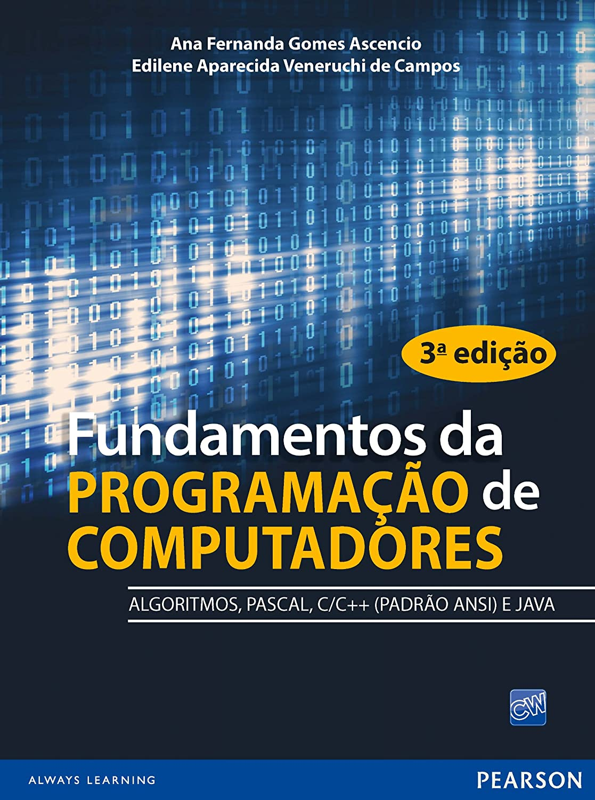

# PROJETO FINAL
Disciplina: __Linguagem e Técnicas de Programação I__ 
Professora: __Flávia Aparecida Oliveira Santos__ 
Linguagem utilizada: __C__  

Código implementado por:  
* Vinicius
* Gustavo
* Andressa
* Gabriel
* Joao Paulo [GITHUB](https://github.com/jpfreitasalvi)

## Fundamentos da PROGRAMAÇÃO de COMPUTADORES 3ª edição

### Desafio 19

#### Programas utilizados
* [DEV C++](https://sourceforge.net/projects/orwelldevcpp/)
* [VSCODE](https://code.visualstudio.com/)
