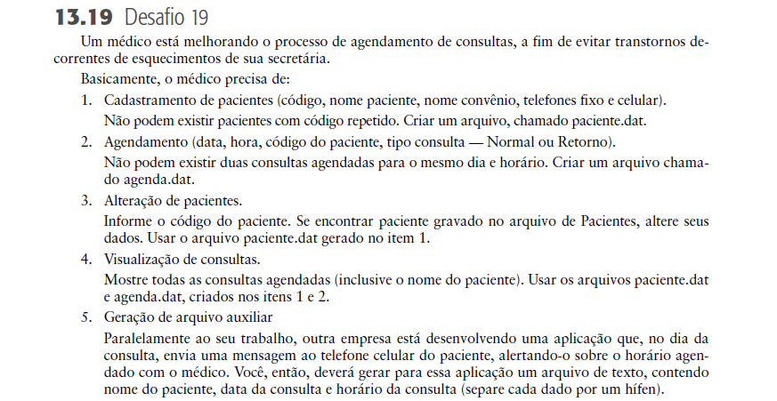

# PROJETO FINAL
Disciplina: __Linguagem e Técnicas de Programação I__ 
Professora: __Flávia Aparecida Oliveira Santos__ 
Linguagem utilizada: __C__  

Tópicos abordados:
* Tópico 1 – __Cadastrar__
* Tópico 2 – __Consultar__
* Tópico 3 – __Gerar arquivo do tipo *.txt__
* Tópico 4 - __Excluir__ (Em implementação)

### Desafio 19

Desafio retirado do livro Fundamentos da programação de computadores 3ª edição.  

Código implementado por:
* [Vinicius](https://github.com/ViniciusMataRibeiro)
* [Gustavo da Silva](https://github.com/Ch0kitus)
* Andressa
* [Gabriel](https://github.com/Gabriel-SRibeiro)
* [João Paulo Freitas](https://github.com/jpfreitasalvi)

#### Programas utilizados
* [DEV C++](https://sourceforge.net/projects/orwelldevcpp/)
* [VSCODE](https://code.visualstudio.com/)
